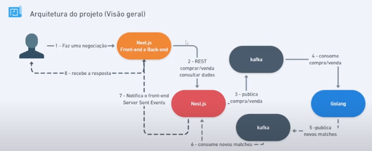

# Imersão FullCycle & FullStack 13 - Home Broker

> Projetos do evento Imersão FullCycle & FullStack 13 - Home Broker da FullCycle / CodeEdu

## Tecnologias

- Linguagem Go
- Typescript
- Next.js / React.js
- Nest.js / Node.js
- Apache Kafka
- Docker
- SSE - Server sent events

## Dinâmica do projeto / Arquitetura Geral

### Detalhamento

## Repositórios

- [Microsserviço Simulador de Bolsa de Valores](ms-bolsa-simulator/README.md)
- [Microsserviço de Backend do Home Broker](ms-homebroker-nest/README.md)
- [Microsserviço de Frontend do Home Broker](ms-homebroker-next/README.md) (em breve)
