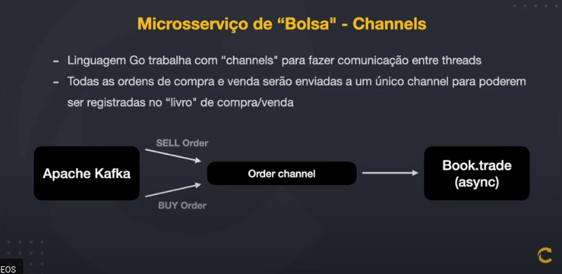

# Imersão FullCycle & FullStack 13 - Home Broker

> Projetos do evento Imersão FullCycle & FullStack 13 - Home Broker da FullCycle / CodeEdu

## Tecnologias

- Linguagem Go
- Typescript
- Next.js / React.js
- Nest.js / Node.js
- Apache Kafka
- Docker
- SSE - Server sent events

## Dinâmica do projeto

## Entendendo as Filas de Ordem de Compra e Ordem de Venda

## Como vai funcionar o microsserviço de simulação da bolsa de valores

## Repositórios (em breve)

- [Microsserviço Simulador de Bolsa de Valores](ms-bolsa/README.md)
- [Microsserviço de Backend do Home Broker](ms-homebroker-nest/README.md)
- [Microsserviço de Frontend do Home Broker](ms-homebroker-next/README.md)
