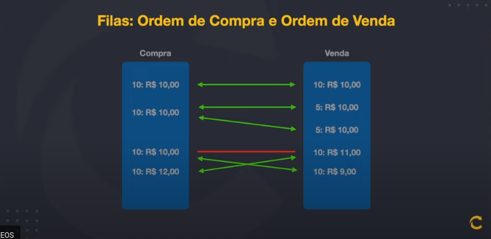
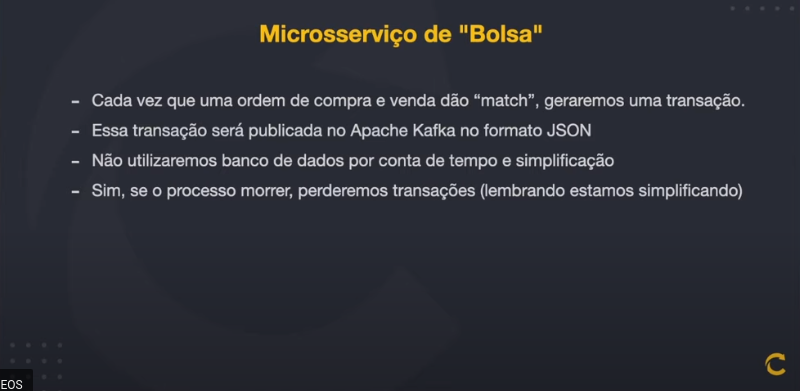
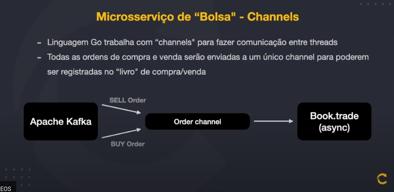
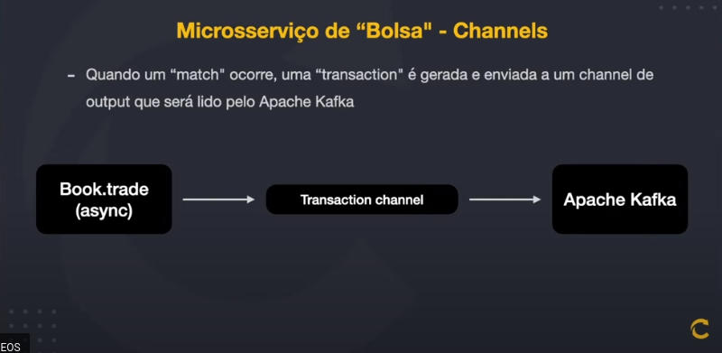

# Simulador de Bolsa de Valores

> Projeto do evento Imersão FullCycle & FullStack 13 - Home Broker da FullCycle / CodeEdu

## Tecnologias

- Linguagem Go
- Apache Kafka

## Entendendo as Filas de Ordem de Compra e Ordem de Venda

## Como vai funcionar o microsserviço de simulação da bolsa de valores

## Guia

- Iniciando projeto go: go mod init github.com/rodolfoHOk/fullcycle.imersao13/ms-bolsa-simulator
- Instalando dependências externas: go mod tidy

## Como rodar

### Requisitos

- go lang instalado

### Comandos para rodar

- clonar no repositório git: https://github.com/rodolfoHOk/fullcycle.imersao13.git
- cd kafka
- docker compose up -d
- cd ..
- cd
- cd ms-bolsa-simulator
- go run cmd/trade/main.go
