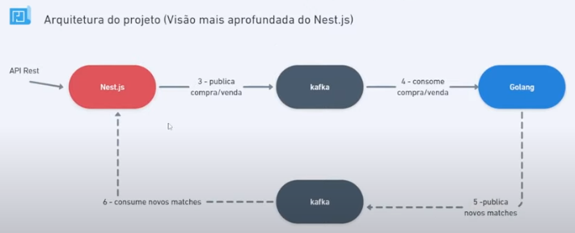

# Home Broker - Backend

> Projeto do evento Imersão FullCycle & FullStack 13 - Home Broker da FullCycle / CodeEdu

## Tecnologias

- Typescript / Javascript
- Nest.js
- Prisma ORM
- MongoDB
- Rest
- Kafka
- Server Send Events
- Watch do MongoDB

## Arquitetura do backend Nest

## Guias

### Nest js CLI

- iniciar projeto com nest.js: npx @nestjs/cli new ms-homebroker-nest
- criar um modulo com nest cli: npx nest generate module prisma
- criar um serviço com nest cli dentro do modulo prisma: npx nest generate service prisma/prisma
- criar um recurso com nest cli: npx generate resource / assets / REST API / n
- criar um controller com nest cli: npx generate controller wallets/wallet-assets

### Prisma ORM

- iniciar o prisma orm no projeto: npx prisma init
- criar as models do schema.prisma: npx prisma generate

## Como rodar

### Requisitos

- Docker
- arquivo /etc/hosts deve conter linha: 127.0.0.1 host.docker.internal ...
- ter clonado o repositório git: https://github.com/rodolfoHOk/fullcycle.imersao13.git
- estar rodando ms-bolsa-simulator ([vide](../ms-bolsa-simulator/README.md))

### Comandos para rodar

- estando na raiz do repositório
- cd ms-homebroker-nest
- docker compose up -d
- docker compose exec app bash
- npm install
- npx prisma generate
- npm run start:dev
