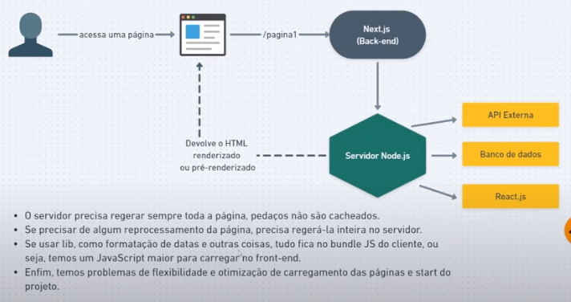
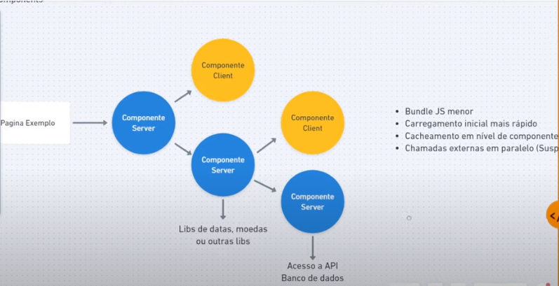

# Home Broker - FrontEnd

> Projeto do evento Imersão FullCycle & FullStack 13 - Home Broker da FullCycle / CodeEdu

## Tecnologias

- Typescript / Javascript
- React.js
- Next.js
- React Server Components
- React Client Components
- Rest
- Tailwind CSS
- Server Send Events

### Bibliotecas adicionais

- [Flowbite React](https://www.flowbite-react.com/)
- [Lightweight Charts](https://www.tradingview.com/lightweight-charts/)
- [SWR](https://swr.vercel.app/)

## React Server Components

Server Side Rendering

React Server Components

## Guia

- criar um projeto com Next.js: npx create-next-app / ms-homebroker-next / Yes (5 vezes) / No

## Como rodar

### Requisitos

- Docker
- ter clonado o repositório git: https://github.com/rodolfoHOk/fullcycle.imersao13.git
- estar rodando ms-homebroker-nest ([vide](../ms-homebroker-nest/README.md))

### Comandos para rodar

- estando na raiz do repositório
- cd ms-homebroker-next
- docker compose up -d
- docker compose exec app bash
- npm install
- npm run dev
